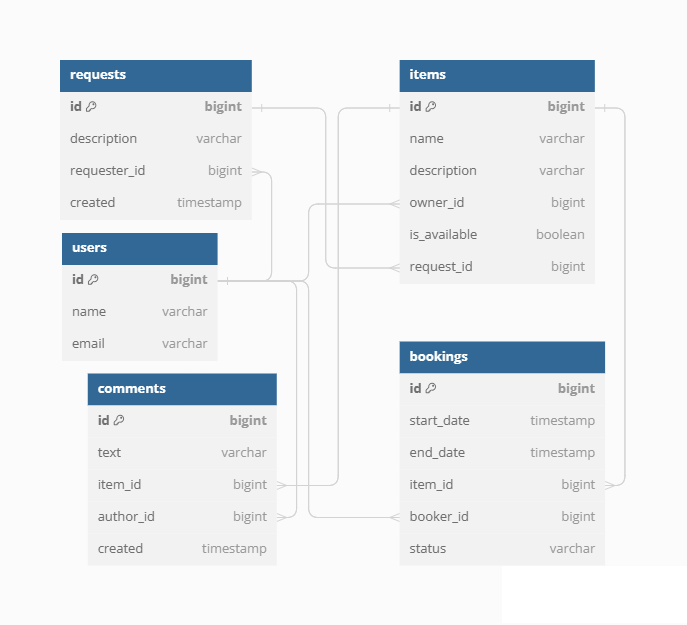

# ShareIt

### Описание

ShareIt - это сервис для шеринга (от англ. share — «делиться») вещей.

Существуют случаи, когда необходима какая-то вещь, для непродолжительного использования. Тогда мы или обращаемся к своим родственникам/друзьям, или вызываем мастера (если это касается какого-то инструмента), или покупаем эту вещь в магазине.
Но на сколько удобнее, а порой и экономичнее, если под рукой есть сервис, где пользователи делятся вещами!

Шеринг как экономика совместного использования набирает сейчас всё большую популярность.

ShareIt обеспечивает пользователям, во-первых, возможность рассказывать, какими вещами они готовы поделиться, а во-вторых, находить нужную вещь и брать её в аренду на какое-то время.

### Функциональные возможности

Сервис не только позволяет бронировать вещь на определённые даты, но и закрывет к ней доступ на время бронирования от других желающих. На случай, если нужной вещи на сервисе нет, у пользователей есть возможность оставлять запросы.
Другие пользователи могут по запросу добавлять новые вещи для шеринга.
Так же у пользователя, бравшего в аренду вещь, имеется возможность оставлять к ней комментарии.

### Особенности разработки

Программа написана на языке Java с использованием IntelliJ IDEA. Сборка проекта реализуется с помощью Maven, а так же была реализована работа с платформой Docker. Приложение является примером микросервисной архитектуры, состоящим из двух модулей (основной сервис и gateway).
Изначально запрос от клиента попадает в gateway, где происходит валидация данных (это помогает разгрузить основной сервис). Затем данные передаются в основной сервис, где происходит их обработка, согласно лонике программы.

Для хранения данных используется реляционная база данных PosgreSQL.

**`users`**
- `id` - идентификатор пользователя;
- `name` - имя пользователя;
- `email` - электронный адрес пользователя.

**`items`**
- `id` - идентификатор вещи;
- `name` - название вещи;
- `description` - описание вещи;
- `owner_id` - идентификатор владельца вещи;
- `is_available` - доступность вещи к аренде;
- `request_id` - идентификатор запроса, на основании которого была добавлена вещь.

**`request`**
- `id` - идентификатор запроса;
- `description` - описание запроса на вещь;
- `requester_id` - идентификатор запрашивающего;
- `created` - дата составления запроса.

**`bookings`**
- `id` - идентификатор аренды;
- `start_date` - дата начала аренды;
- `end_date` - дата окончания аренды;
- `item_id` - идентификатор арендованной вещи;
- `booker_id` - идентификатор арендатора;
- `status` - статус аренды.

**`comments`**
- `id` - идентификатор комментария;
- `text` - текст комментария;
- `item_id` - идентификатор вещи;
- `author_id` - идентификатор автора комментария;
- `created` - дата создания комментария.
